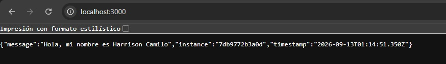
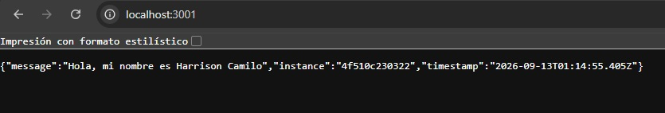
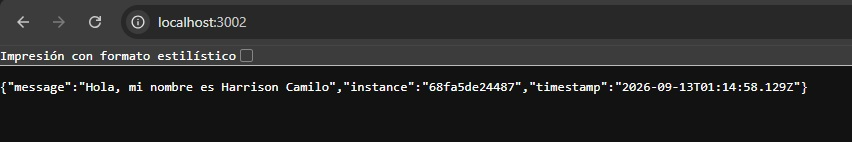

# Laboratorio 02 — Docker Compose 

Despliegue de un servicio web (3 copias de una API mínima, construida localmente)
y una base de datos PostgreSQL, orquestados con Docker Compose.

## stack

- API: Node.js + express — retorna un mensaje que incluye un nombre configurable
  por variable de entorno. Se construye localmente y se levantan 3 copias
  (`api1`, `api2`, `api3`), cada una expuesta en un puerto de host distinto.
- BD: PostgreSQL 16 (imagen oficial `postgres:16-alpine`).

## Requisitos

- Docker y Docker Compose instalados.

## Configuración de variables de entorno

```bash
cp .env.example .env
```

Variable - Descripción - Valor por defecto

`MESSAGE` - Nombre incluido en la respuesta de la API - Harrison Camilo
`API1_PORT` - Puerto de host de la copia 1 de la API - `3000`
`API2_PORT` - Puerto de host de la copia 2 de la API - `3001`
`API3_PORT` - Puerto de host de la copia 3 de la API - `3002`
`POSTGRES_USER` - Usuario de PostgreSQL - `postgres`
`POSTGRES_PASSWORD` - Contraseña de PostgreSQL - `mysecretpassword`
`POSTGRES_DB` - Nombre de la base de datos - `lab02db`
`POSTGRES_PORT` - Puerto de host de PostgreSQL - `5432`

## uso de volumenes en este proyecto

- `db_data` (volumen nombrado): persiste los datos de PostgreSQL, sobrevive a `docker compose down`
- `api_logs` (volumen nombrado): compartido entre las 3 copias de la API
- `./db/init` - `/docker-entrypoint-initdb.d` (bind mount, solo lectura): inicializa el esquema de la BD desde un script en el host

## Tipos de redes en Docker

- bridge: driver por defecto. Red virtual privada aislada en el host, los contenedores conectados se comunican entre ellos por nombre de servicio
- host: el contenedor usa directamente la red del host, sin aislamiento ni mapeo de puertos.
- none: desactiva la red del contenedor por completo
- overlay: conecta contenedores en distintos hosts/nodos (Docker Swarm).
- macvlan: asigna una IP/MAC propia al contenedor dentro de la red física, como si fuese un dispositivo más
- ipvlan: similar a macvlan, pero comparte la MAC y se diferencia por IP

## Tipos de volumenes en Docker

- Named volumes: administrados por Docker, ideales para persistencia de datos. Ejemplo: `db_data`, `api_logs`.
- Bind mounts: montan una ruta específica del host dentro del contenedor. Ejemplo: `./db/init`.
- tmpfs mounts: almacenan datos solo en RAM, se pierden al detener el contenedor.
- Anonymous volumes: como un volumen nombrado, pero sin nombre asignado explícitamente por el usuario.

## Conventional Commits

Ejemplos usados:

```
feat: agregar API mínima con Express
feat: agregar script de inicialización de PostgreSQL
feat: agregar docker-compose con 3 copias de la API, PostgreSQL, volúmenes y redes
chore: agregar .gitignore
docs: documentar comandos, redes y volúmenes de Docker
```
## Capturas del proyecto desplegado

Estado de los contenedores (`docker compose ps`):


Respuestas de las 3 copias de la API:







# Créditos

- Harrison Camilo